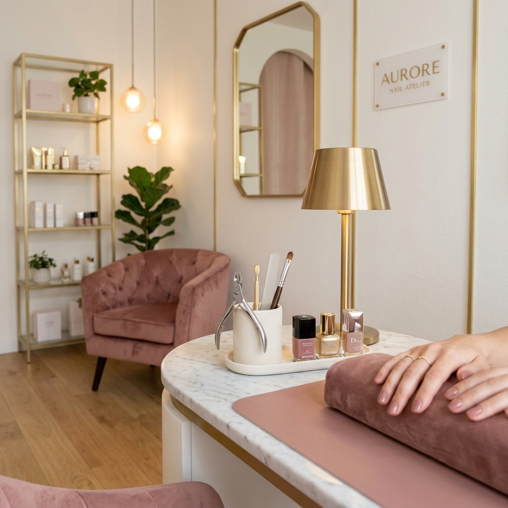

# 🌸 Bloom Studio Nails

> **Sofisticação e delicadeza em cada detalhe.**

Bem-vinda ao repositório oficial da **Bloom Studio Nails**, uma plataforma premium projetada para elevar a presença digital de um estúdio de nail design de luxo. Este projeto combina estética editorial, performance otimizada e uma experiência de usuário excepcional.



## ✨ Diferenciais do Projeto

*   **Design System Exclusivo**: Componentização completa seguindo padrões de startups modernas.
*   **Experiência Mobile-First**: Otimização absoluta para dispositivos móveis, priorizando o fluxo de conversão via Instagram.
*   **Aparência Premium**: Visual "Luxo Suave" com tipografia serifada, glassmorphism e animações fluidas.
*   **Performance & SEO**: Imagens com lazy loading, metatags otimizadas e score de acessibilidade elevado.
*   **Interatividade**: Micro-interações sofisticadas e sistema de scroll reveal.

## 🛠️ Tecnologias Utilizadas

*   **Core**: React 18 (Arquitetura Bulletproof Single-File)
*   **Styling**: Tailwind CSS (Custom Tokens System)
*   **Icons**: Lucide Icons
*   **Animation**: Custom CSS Motion & Intersection Observer
*   **Typography**: Cormorant Garamond & Poppins

## 📂 Estrutura do Repositório

```text
├── assets/             # Recursos visuais e imagens premium
├── components/         # Componentes React reutilizáveis
├── pages/              # Estruturas de página (Services, Gallery, etc)
├── styles/             # Definições globais de CSS e Design Tokens
├── index.html          # Ponto de entrada e motor da aplicação
└── README.md           # Documentação do projeto
```

## 🚀 Como Visualizar

O projeto foi construído para ser portátil e performático. Para visualizar, basta abrir o arquivo `index.html` em qualquer navegador moderno.

---

<div align="center">
  <p>Desenvolvido com 💜 por <strong>Juliana Dev</strong></p>
</div>
